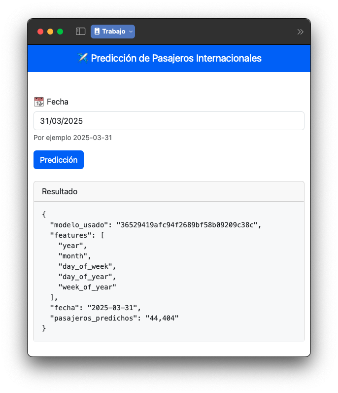

# Trabajo Práctico Final - MLOps

## Eje Temático
- Experimentación y comparación de modelos con MLflow

## Integrantes
- Castillo Maira
- Fera Camila
- Izzo Paula Ruth
- Meola Franco Román

## Dataset: Conectividad Aérea
### Vuelos, asientos y pasajeros por día según clasificación de vuelo

- **Fuente**: SINTA (Sistema de Información Turística de la Argentina) 
https://datos.yvera.gob.ar/dataset/conectividad-aerea
- **Previsualización**:
https://datos.yvera.gob.ar/dataset/conectividad-aerea/archivo/03b4176f-a065-450a-b411-101d2a884720
- **Campos**:

| Campo                 | Tipo           | Descripción             |
|-----------------------|----------------|-------------------------|
| `indice_tiempo`       | Fecha ISO-8601 | Indice de tiempo diario |
| `clasificacion_vuelo` | String         | Tipo de conexión        |
| `pasajeros`           | Number         | Cantidad de pasajeros   |
| `asientos`            | Number         | Cantidad de asientos    |
| `vuelos`              | Number         | Cantidad de vuelos      |

## Instrucciones para la ejecución del ambiente y los experimentos

1. Ejecutar `app_prediction.py` para iniciar mlflow y fastapi

```bash
python app_prediction.py
```

2. Ejecutar `run_experiment.py` para cargar los modelos y hacer el deploy en fastapi

```bash
python run_experiment.py
```

## Instrucciones para consultar las predicciones

Consultar la predicción de la cantidad de pasajeros internacionales
utilizando el mejor modelo registrado

### Opción 1: Desde el navegador

Accediendo a la URL http://127.0.0.1:8000



### Opción 2: Request HTTP GET

Haciendo GET HTTP al siguiente endpoint `127.0.0.1:8000/pasajeros_internacionales?fecha=2025-03-31`

En ambas en la respuesta se obtiene, además del valor de la predicción,
el `run_id` correspondiente al modelo y las `features` que ese mejor modelo utiliza.

```json
{
  "modelo_usado": "a8188f5848fa439d8eb024bc01f2a16e",
  "features": [
    "year",
    "month",
    "day_of_week",
    "day_of_year",
    "week_of_year"
  ],
  "fecha": "2025-03-31",
  "pasajeros_predichos": "44,404"
}
```